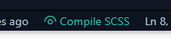

# Scss To Css
[中文文档](./READM_ZH.md)

> 💠 Compile SCSS files easily to css and minified version.
## Configuration
> Some configuration can be set, which it works better for you。
>> - `compileOnSave`: Auto compile on Save, default `true`
>> - `output`: Output style. default `expanded | compressed`
>> - `outDir`: Output dir. default `./dist` support `./dist`  or `../dist` or `/dist`
>> - `showButtons`: Show button in the status bar. default `true`
>> - `autoPrefixer`: Enables AutoFixer. default `false`
>> - `browsers`: Add a list of browsers to support. default `[]`
## Usage/Shortcuts
1. Click to `Compile SCSS` from Statusbar to compile the SCSS file, or just save the file instead.  

2. Generate SCSS file from CSS, simply search for `Css to Scss` in the commands and execute it.

## Installation

[Download](https://marketplace.visualstudio.com/items?itemName=oorzc.scss-to-css-compile)

> Search `scss-to-css-complie` and install it from the marketplace.